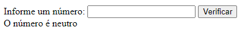

[Projeto - Aprendendo a escrever um README](#projeto---aprendendo-a-escrever-um-readme) 

[Descrição](#descri%C3%A7%C3%A3o)   

[Introdução](#introdu%C3%A7%C3%A3o)   

[Funcionalidades](#funcionalidades)   

[Tenólogias utilizadas](#tecnol%C3%B3gias-utilizadas)   

[Fontes consultadas](#fontes-consultadas)  

[autores](#autores)  
#ATDIII - Verificando números

## Descrição:
  São dois códigos, o primeiro verifica se o número é redondo ou não, já o segundo verifica se o número é positivo, negativo ou neutro. Ambos precisam da resposta do usuário para dar a 
  resposta.

## Introdução:
  O primeiro código foi feito para verificar se o número dado pelo usuário é ou não redondo, possuindo em sua página apenas uma função que é a de inserir um número e apertar o botão 
  "verificar". O segundo código é extremamente similar, só tendo a diferença na verificação, podendo receber três respostas diferentes; positivo, negativo e neutro.

  ## Funcionalidades:
  - `Verificar`: caixa de texto onde pode ser inserido o número.
 
